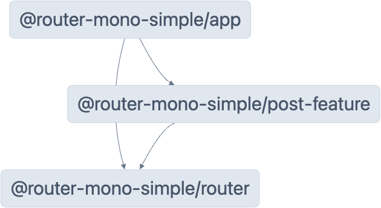

# Example of a monorepo with router and feature libraries

To run this example:

- `npm install` or `yarn`
- `npm dev` or `yarn dev`

The challenge with TanStack router is that it needs to be setup with typescript types augmentations. But that means that if you do that in the final app, the links in the libraries will not be type safe. So to make that work in a monorepo, we need a separate library to contains the router, without components and then stitch it together with the app.

This example does it using the following packages:
- `pacakges/router` is the router library
- `packages/post-feature` is the posts ui library
- `packages/app` is the app

With this approach, we can use loaders the router, and in the feature library without causing circular dependencies, while keeping full type safety.

And given the router lib re exposes the router components, when we import them in the feature library they are type safe given they are linked to the typescript augmentations.

And finally, in the app, we can create a map of route to component ([`packages/app/src/main.tsx`](./packages/app/src/main.tsx)) that is used to stitch the router together with the components. **We could enforce lazy loading here also, but this was omitted for simplicity**, and we now have a fully type safe router!

Here is what it looks like in the monorepo:

## Stackblitz limitation

### Typescript IDE feedback

Due to a limitation on Stackblitz, the example's types are not properly inferred in the IDE, however as soon as you click on fork in the bottom right corner, the types should be correctly inferred.
